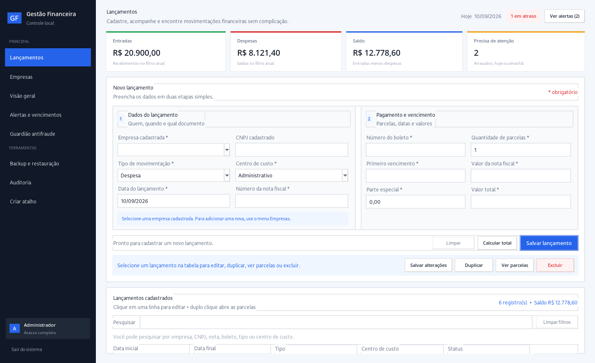
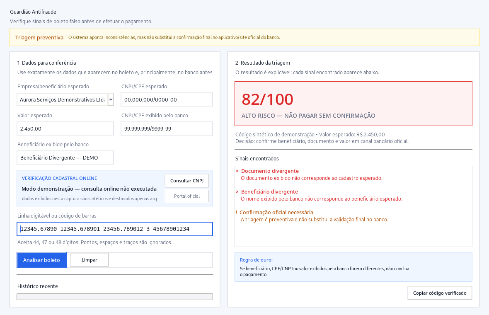
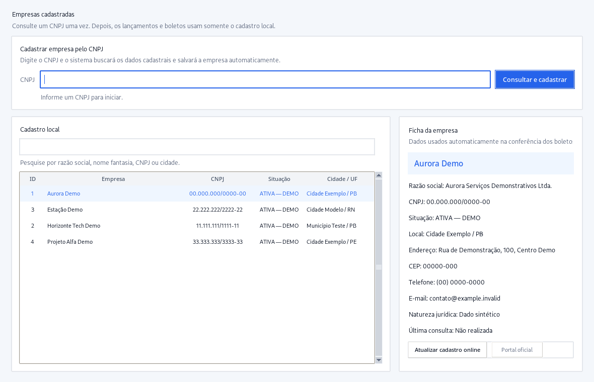
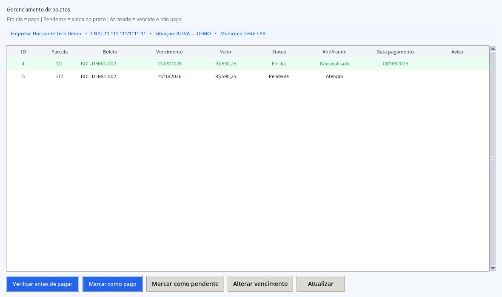
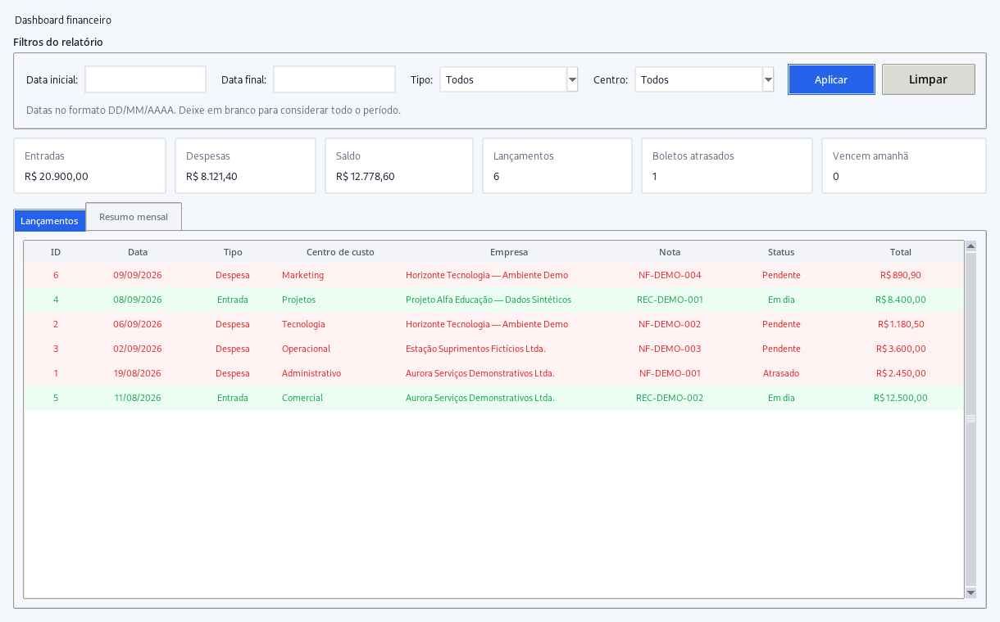
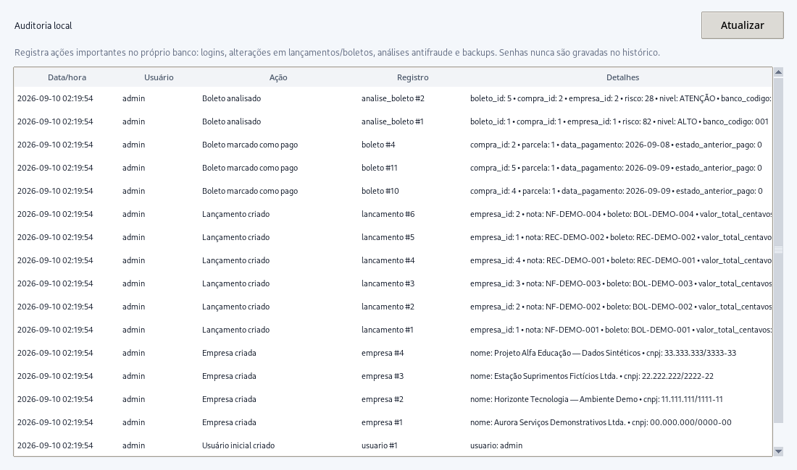
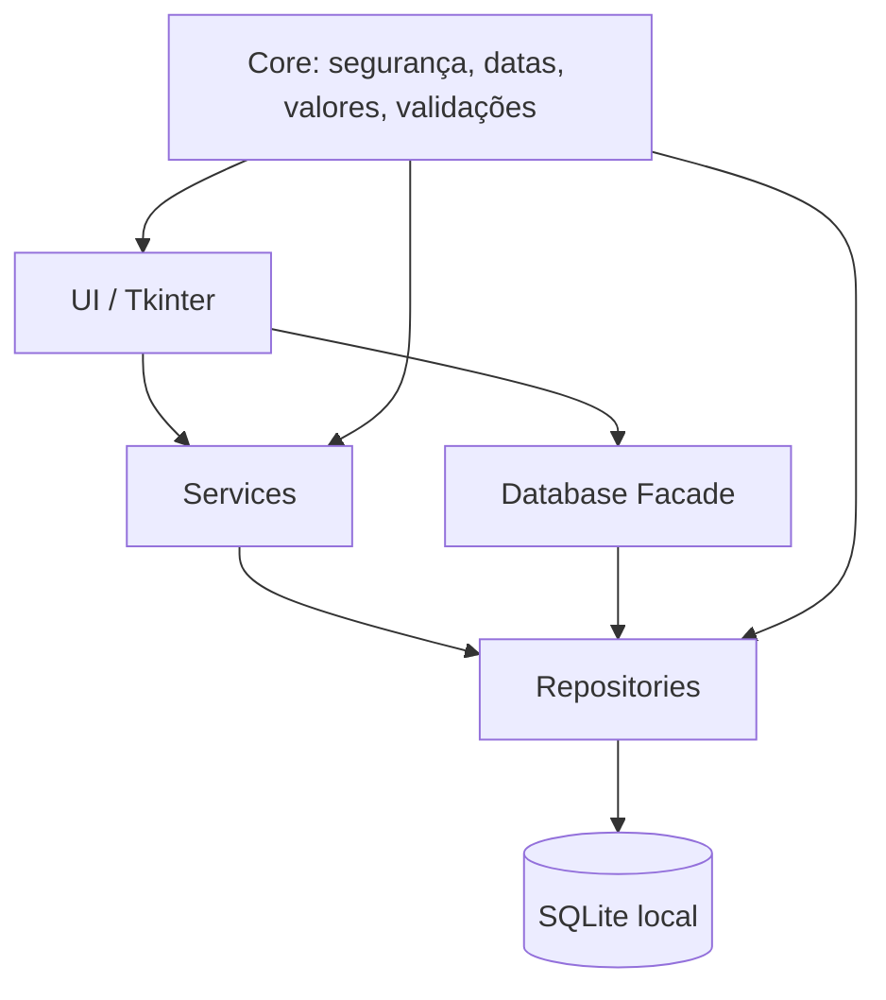

# Gestão Financeira de Empresas — Controle de Boletos

[](https://github.com/Jefferson21092008/gestao-financeira-boletos/actions/workflows/ci.yml)


Aplicação desktop local desenvolvida em **Python, Tkinter e SQLite** para organizar o fluxo financeiro de empresas, acompanhar parcelas e boletos e apoiar a conferência preventiva antes do pagamento.

O projeto nasceu como um sistema monolítico de milhares de linhas e foi refatorado para uma arquitetura modular com repositórios, serviços, auditoria, migrações de banco, testes automatizados e empacotamento para Windows.

> [!IMPORTANT]
> O **Guardião Antifraude** é uma ferramenta de **triagem preventiva**. Ele identifica inconsistências e sinais de risco, mas não confirma sozinho que um boleto é autêntico. A validação final deve ser feita no aplicativo/site oficial do banco ou por outro canal oficial e independente.

## Destaques

- cadastro e consulta de empresas/CNPJ;
- lançamentos de entradas e despesas;
- parcelamento com divisão exata em centavos;
- controle de vencimentos, atrasos e pagamentos;
- dashboard e relatórios locais;
- Guardião Antifraude para códigos de pagamento, valores, documentos, beneficiário e histórico;
- consulta cadastral de CNPJ quando houver internet;
- auditoria local das principais ações;
- backup manual/automático, restauração e cópia externa;
- primeiro acesso sem senha administrativa padrão;
- build em `.exe` para Windows com PyInstaller;
- suíte automatizada com **21 testes** e integração contínua no GitHub Actions.

## Interface

> Todas as capturas abaixo usam **dados sintéticos de demonstração**. Nenhum CNPJ, boleto, fornecedor ou valor operacional real foi utilizado nas imagens do portfólio.

### Tela principal



### Guardião Antifraude



<details>
<summary><strong>Ver outras telas do sistema</strong></summary>

#### Empresas cadastradas



#### Boletos e parcelas



#### Dashboard financeiro



#### Auditoria local



</details>

## Arquitetura

O sistema é um **monólito desktop modular**. Para um cenário de uso em um único computador, essa abordagem mantém a implantação simples sem abrir mão da separação de responsabilidades.



```text
core/          segurança, CNPJ, datas, valores, formatação e caminhos
database/      conexão, schema, migrações e fachada do banco
repositories/  persistência separada por domínio
services/      antifraude, consulta CNPJ e tarefas em background
ui/            telas Tkinter
tests/         testes automatizados
docs/          arquitetura, migração, qualidade, testes e build
```

Mais detalhes em [`docs/ARQUITETURA.md`](docs/ARQUITETURA.md).

## Segurança e integridade financeira

O projeto usa PBKDF2 para armazenamento de senhas, `Decimal`/centavos inteiros para valores financeiros, migrações compatíveis com bancos antigos, trilha de auditoria e backups validados. Instalações novas exigem a criação de uma senha no primeiro acesso.

Banco real, logs, backups, credenciais e documentos financeiros **não fazem parte do repositório**. Consulte [`SECURITY.md`](SECURITY.md) antes de usar dados reais ou relatar uma vulnerabilidade.

## Executar localmente

O código utiliza apenas a biblioteca padrão do Python em tempo de execução. É necessário **Python 3.10+** com Tkinter disponível. O CI do repositório roda atualmente com Python 3.14.

```bash
git clone https://github.com/Jefferson21092008/gestao-financeira-boletos.git
cd gestao-financeira-boletos
python main.py
```

No Windows, também é possível iniciar com:

```text
iniciar.bat
```

Os dados persistentes ficam fora do código-fonte, na área de dados do usuário. No Windows, o sistema utiliza `%APPDATA%\GestaoEmpresasLocal`.

## Testes e qualidade

Para instalar apenas as ferramentas de desenvolvimento:

```bash
python -m pip install -r requirements-dev.txt
```

Depois execute:

```bash
python -m ruff check .
python -m unittest discover -s tests -v
python -m coverage run -m unittest discover -s tests -v
python -m coverage report -m
```

O GitHub Actions executa automaticamente lint, compilação, testes e cobertura em pushes e pull requests para `main`. O piso inicial de cobertura configurado é de **55%** nas camadas centrais do sistema.

Veja [`docs/QUALIDADE.md`](docs/QUALIDADE.md) e [`docs/TESTES_MANUAIS.md`](docs/TESTES_MANUAIS.md).

## Gerar executável para Windows

O modo recomendado é o build em pasta:

```text
build_exe.bat
```

Saída:

```text
dist\GestaoFinanceira\GestaoFinanceira.exe
```

Também existe `build_exe_unico.bat` para gerar uma única unidade executável. O PyInstaller é dependência apenas do processo de build; a máquina que executará o programa empacotado não precisa ter Python instalado.

Mais detalhes em [`docs/GERAR_EXECUTAVEL.md`](docs/GERAR_EXECUTAVEL.md).

## Fluxo de contribuição

O repositório usa `main` como branch estável. Melhorias devem, de preferência, ser feitas em branches `feat/`, `fix/`, `docs/`, `test/` ou `refactor/` e integradas por Pull Request após os testes.

Leia [`CONTRIBUTING.md`](CONTRIBUTING.md).

## Limitações atuais

O projeto ainda está em homologação. A interface gráfica não possui testes automatizados completos, a consulta cadastral externa depende da disponibilidade do serviço utilizado e o Guardião Antifraude não substitui a confirmação bancária oficial.

## Estado do projeto

**V12.1.3 — public-ready tooling**

A versão atual concentra a evolução do sistema local: arquitetura modular, valores exatos em centavos, auditoria, migração segura de bancos antigos, backup externo, testes automatizados, lint, cobertura e CI.

## Objetivo técnico

Além de resolver um problema operacional, o projeto documenta uma evolução prática de engenharia de software em Python: refatoração de legado, separação de responsabilidades, persistência local, migração de schema, segurança de autenticação, validações financeiras, testes e distribuição de aplicações desktop.
